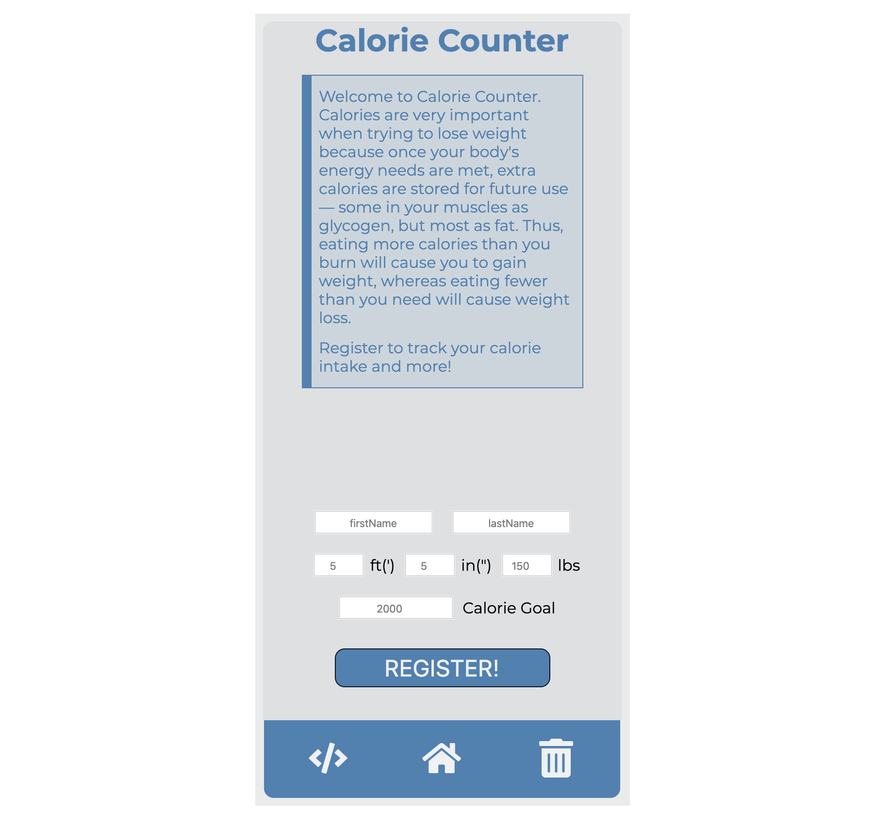
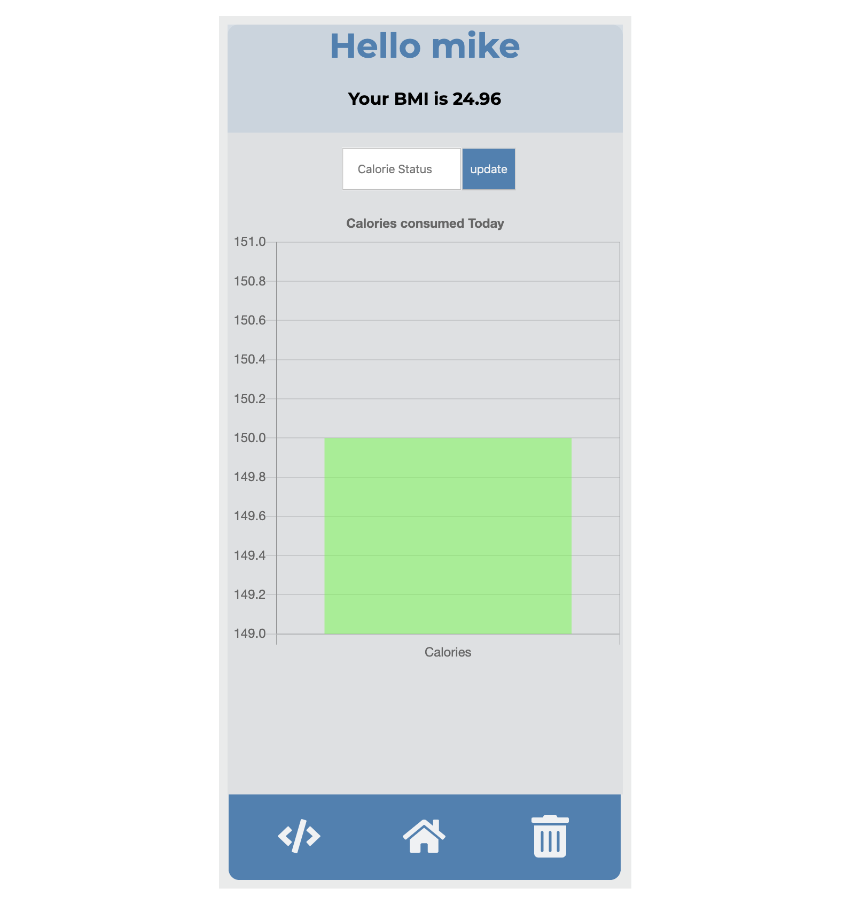

# Calorie Counter

## Problem

> Weight loss is a very hard pursuit and counting your calories 
> can help significantly. 
> To save time, I have created this calorie as a helper to keep track
> of calories.

#### Technology Used

> React, JavaScript, CSS, NPM, Chartjs
> [Check out Calorie Counter](https://calorie-counter-michael-anokye.netlify.app/ "Link to Calorie Counter").

## Landing Screen

> Calorie Counter welcomes you with a home screen where the user get a little information
> about what the app is and what it is about.
> The user can also register to get full access.

> 

## User Information Screen

> The user can update the calories consumed throughout
> the day. A bar chart is showed showing the status of the
> calories. The bar chart color changes depending 
> on the status compared to the calorie goal.
> 

## Video Demo

> Below is a video demo of how Calorie Counter works.
> 
